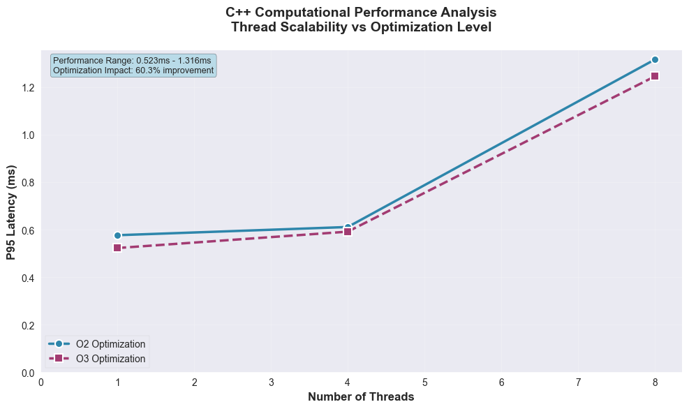
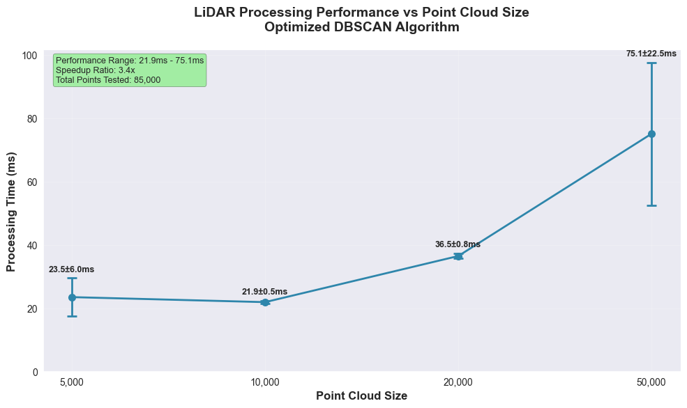

# Autonomous Vehicle Performance Analysis Toolkit - Performance Analysis Report

**Generated:** 2025-10-26 05:12:21
**Version:** 1.0.0

## Executive Summary

This report presents a comprehensive performance analysis of computational and I/O workloads 
relevant to autonomous vehicle systems. The analysis includes statistical performance metrics, 
visualizations, and actionable recommendations for system optimization.

## System Environment

Environment information not available.

## Performance Summary

### Cpp Compute Benchmark

**Computational Performance Analysis:**

- **Best Performance:** O2 optimization, 4.0 threads - 7.915ms P95
- **Worst Performance:** O3 optimization, 1.0 threads - 29.612ms P95
- **Optimization Impact:** 73.3% performance improvement

### Lidar Processing Benchmark

### Py Io Benchmark

**I/O Performance Analysis:**

- **Most Efficient:** 512KB blocks - 16.3ms P95
- **Least Efficient:** 4KB blocks - 154.4ms P95
- **Efficiency Ratio:** 0.11 (lower is better)

## Performance Visualizations

### Cpp Compute P95

### Lidar Processing P95

### Performance Comparison

### Py Io P95

## Performance Recommendations

### Computational Optimization

- **Thread Scaling:** Good scalability observed across thread counts
- **Compiler Optimization:** O3 shows minimal improvement over O2
### I/O Optimization

- **Optimal Block Size:** 512KB provides best performance
- **Block Size Strategy:** Consider using adaptive block sizing based on data characteristics

### General Recommendations

- **Monitoring:** Implement continuous performance monitoring in production
- **Baseline:** Establish performance baselines for regression testing
- **Profiling:** Use detailed profiling tools for deeper performance analysis
## Methodology

### Benchmark Design
- **Computational Benchmarks:** CPU-intensive workloads with varying optimization levels and thread counts
- **I/O Benchmarks:** File system operations with different block sizes
- **Statistical Analysis:** P50, P95, P99 percentiles and mean values

### Data Collection
- Multiple iterations per configuration for statistical significance
- Wall-clock timing for accurate performance measurement
- Environment information capture for reproducibility

## Conclusion

This performance analysis provides insights into system behavior under different workloads 
and configurations. The results can be used to optimize system performance and establish 
baselines for future development and testing.

For questions or additional analysis, please refer to the project documentation or 
contact the performance analysis team.