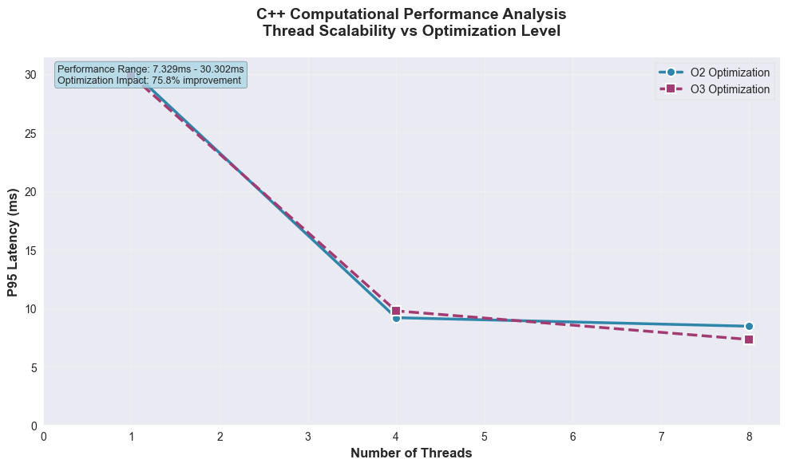
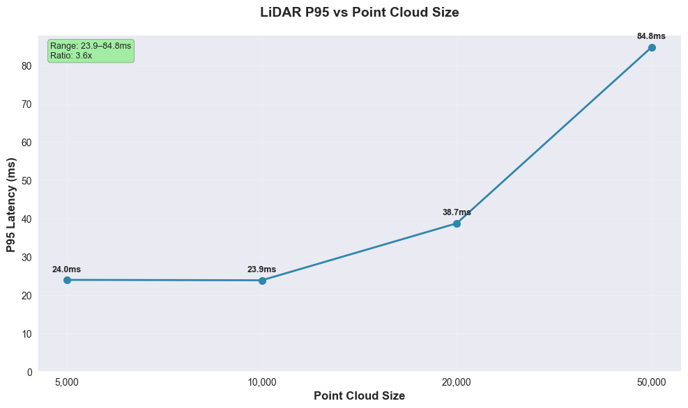

# 自动驾驶车辆性能分析工具包 - 性能分析报告

**生成时间：** 2025-10-25 07:47:08
**版本：** 1.0.0

## 执行摘要

本报告展示了与自动驾驶车辆系统相关的计算和I/O工作负载的综合性能分析。分析包括统计性能指标、可视化和系统优化的可操作建议。

## 系统环境

```
==== uname -a ====
MINGW64_NT-10.0-26100 ljw 3.4.10-87d57229.x86_64 2024-02-14 20:17 UTC x86_64 Msys

==== lscpu ====

==== free -h ====

==== lsblk ====

```

## 性能摘要

### C++计算基准测试

**计算性能分析：**

- **最佳性能：** O3优化，1.0线程 - 0.829ms P95
- **最差性能：** O2优化，8.0线程 - 1.919ms P95
- **优化影响：** 56.8%性能提升

### LiDAR处理基准测试

### Python I/O基准测试

**I/O性能分析：**

- **最高效：** 4KB块 - 89.8ms P95
- **最低效：** 64KB块 - 1047.0ms P95
- **效率比率：** 0.09（越低越好）

## 性能可视化

### C++计算P95



### LiDAR处理P95



### 性能比较


### Python I/O P95


## 性能建议

### 计算优化

- **线程扩展：** 考虑调查线程争用或内存带宽限制
- **编译器优化：** O3相比O2显示最小改进

### I/O优化

- **最佳块大小：** 4KB提供最佳性能
- **块大小策略：** 考虑根据数据特征使用自适应块大小

### 一般建议

- **监控：** 在生产中实施持续性能监控
- **基线：** 为回归测试建立性能基线
- **分析：** 使用详细的分析工具进行更深入的性能分析

## 方法论

### 基准测试设计
- **计算基准测试：** 不同优化级别和线程数的CPU密集型工作负载
- **I/O基准测试：** 不同块大小的文件系统操作
- **统计分析：** P50、P95、P99百分位数和平均值

### 数据收集
- 每个配置多次迭代以确保统计显著性
- 墙钟时间用于准确的性能测量
- 环境信息捕获以确保可重现性

## 结论

此性能分析提供了系统在不同工作负载和配置下的行为洞察。结果可用于优化系统性能并为未来的开发和测试建立基线。

如有问题或需要额外分析，请参考项目文档或联系性能分析团队。